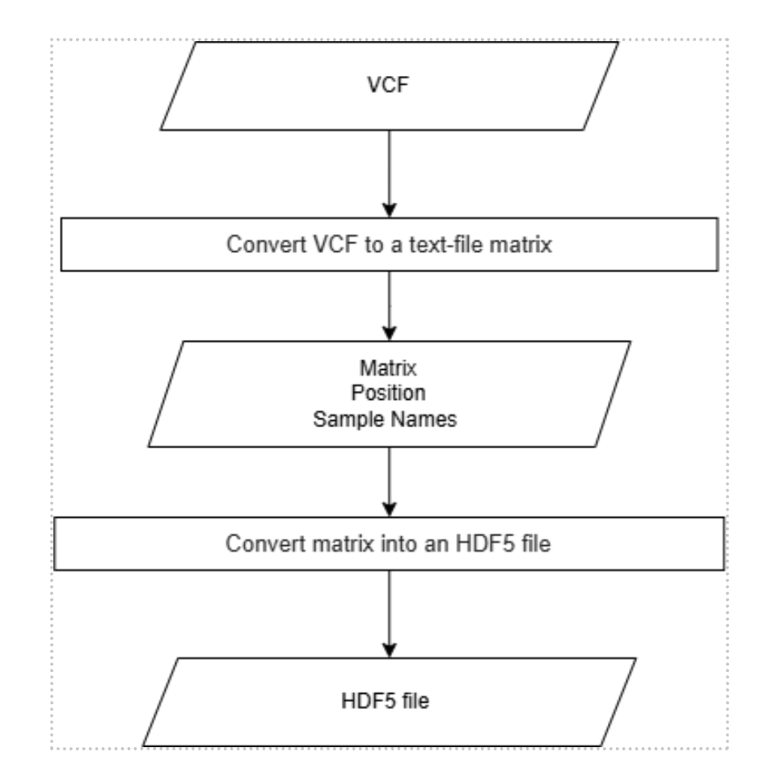
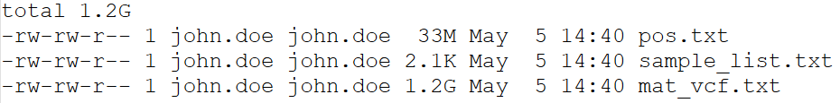
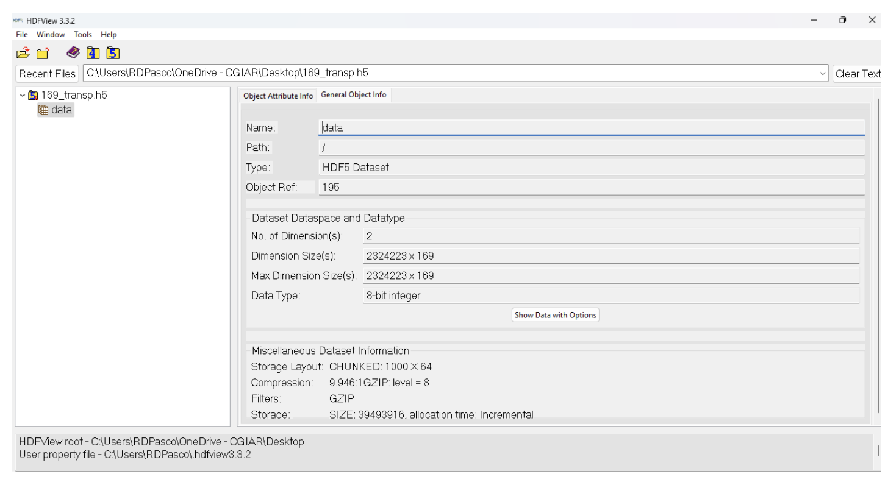

# Workflow

<p align="center">

</p>
---

## 📥 Input

- `VCF` file: `169.vcf.gz`


---

## 🔄 VCF to Matrix

### 🔧 Script: `vcftomatrix.sh`

```bash
invcf=169.vcf.gz
pref=169

mkdir -p $pref

bcftools query -f '%CHROM\t%POS\t%REF\t%ALT[\t%TGT]\n' $invcf | \
  tr "|" "/" | \
  tr -d "/" | \
  sed "s:chr0\\?::" | \
  awk -v OFS="\t" '{$1 = $1 + 0; print $0}' > ${pref}/mat_vcf.txt

cut -f1-4 $pref/mat_vcf.txt > $pref/pos.txt

# The following fails for some reason (grep CHR part)
bcftools view -o - -h $invcf | \
  grep CHR | \
  tr "\t" "\n" | \
  tail -n +10 > $pref/sample_list.txt
```

### 📤 Output Files

- `pos.txt`
- `sample_list.txt`
- `mat_vcf.txt`


---

## 🔄 Matrix to HDF5

### ▶️ Command

```bash
./make_HDF_dataset.sh <input-dir> <output-prefix>
```

Example:

```bash
./make_HDF_dataset.sh /home/scratch3/169 169
```

### 📤 Output File

- `169_transp.h5`



<p align="center">

</p>

---
